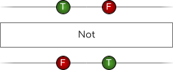
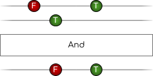
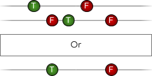
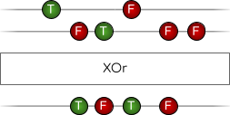
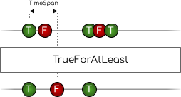
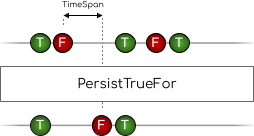
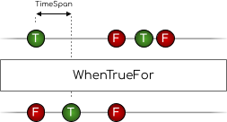
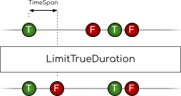

# Reactive.Boolean

[](https://github.com/DevJasperNL/Reactive.Boolean?tab=MIT-1-ov-file)
[](https://github.com/DevJasperNL/Reactive.Boolean/releases/latest)
[](https://github.com/DevJasperNL/Reactive.Boolean/actions/workflows/ci-build-and-test.yml)

Reactive Extensions meant specifically for implementations of `IObservable<bool>`

This documentation uses marble diagrams to explain the transformations of `IObservable<bool>`. More on marble diagrams can be found in the documentation of [ReactiveX](https://reactivex.io/documentation/observable.html).

Article containing examples in relation to home automation: [Article with examples](https://dev.to/devjaspernl/supercharging-home-assistant-automations-initial-states-and-boolean-logic-for-netdaemon-rx-3bd5).

## Logical Operators

This library has extension methods for logical operators.

### Stateful observables
All operators except for `Not` are implemented using `CombineLatest`. This means that the first output is only emitted if all inputs have emitted an value after subscribing. For this reason, it makes sense to apply these logical operators to stateful observables. In this context these are observables that emit their current state the moment an observer subscribes to them. This can easily be achieved by using `Prepend`, preferably in combination with `Observable.Defer`. For example:
```csharp
Observable.Defer(() => stateChanges.Prepend(initialState));
```

### Distinctness
Depending on the operator, there are several ways of handling value distinctness. Different forms are explained below.

### Not

Returns an observable in which the input is inverted.



### And

Returns an observable that combines the latest of the provided observables using an AND operator.
The `And` method accepts three values to determine distinctness of the output:

**OutputDistinctUntilChanged (default)**

DistinctUntilChanged is applied to the returned observable, meaning a "true" can only be followed by a "false" and vice versa.



**InputDistinctUntilChanged**

DistinctUntilChanged is applied to the inputs only. Meaning that consecutive values on the input do not change the output, but input changes on different inputs can. For example, going from "false", "false" to "true", "false" will emit consecutive "false" values.

.png)

**NotDistinct**

DistinctUntilChanged is never applied. Meaning both consecutive input and output values will be emitted.

.png)

### Or

Returns an observable that combines the latest of the provided observables using an OR operator.
The `Or` method accepts three values to determine distinctness of the output:

**OutputDistinctUntilChanged (default)**

DistinctUntilChanged is applied to the returned observable, meaning a "true" can only be followed by a "false" and vice versa.



**InputDistinctUntilChanged**

DistinctUntilChanged is applied to the inputs only. Meaning that consecutive values on the input do not change the output, but input changes on different inputs can. For example, going from "true", "false" to "true", "true" will emit consecutive "true" values.

.png)

**NotDistinct**

DistinctUntilChanged is never applied. Meaning both consecutive input and output values will be emitted.

.png)

### XOr

Returns an observable that combines the latest results of two observables using an XOR operator.
As changing distinct inputs will always result in a distinct XOR output, the `Xor` method accepts only two values to determine distinctness of the output:

**distinctUntilChanged = true (default)**

DistinctUntilChanged is applied to the result.



**distinctUntilChanged = false**

DistinctUntilChanged is not applied to the result.

.png)

### Inverted operators

This library also implements inverted operators `Nand`, `Nor` and `Xnor`.

## Scheduling

This library also has extension methods for scheduling. Every scheduling method takes an `IScheduler`, subscribes to the source exactly once, and behaves the same whether values arrive one at a time from a hot subject or in a burst from a cold observable (for example `Observable.Return(true).Concat(...)` or `SelectMany`).

### Common options

Every timespan must be positive; zero or negative values throw an `ArgumentOutOfRangeException`.

All scheduling methods share three optional parameters:

**resetTimerOnConsecutiveTrue / resetTimerOnConsecutiveFalse (default `false`)**

A real transition (for example `false` to `true` for `TrueForAtLeast`) always starts the timer. This flag decides whether a *repeated* value, emitted while the timer is running, restarts it. For the symmetric `WhenStableFor` the flag is called `resetTimerOnConsecutiveValue`.

**distinctUntilChanged (default `true`)**

When `true`, the resulting observable never emits the same value twice in a row. When `false`, consecutive values from the source are passed through, except where the timer withholds them (details per method below).

**completionBehavior (default `CompletionBehavior.CompleteImmediately`)**

Determines what happens when the source completes while the timer is still running:

- `CompleteImmediately`: the result completes at once. A value that the timer would still have emitted is dropped.
- `CompleteAfterTimer`: the result stays alive until the timer runs out, emits the pending value and completes afterwards. When nothing is pending it completes immediately. For `BlinkWhileTrue` this means finishing the current `true` phase, emitting `false` and completing afterwards.

Errors from the source are always forwarded immediately.

### TrueForAtLeast

Returns an observable that won't emit `false` for at least the provided timespan after an initial `true` is emitted by the source observable.
If a `false` is emitted during the provided timespan, it will be emitted immediately after the timer is completed. With `distinctUntilChanged: false`, multiple `false` values received during the timespan are emitted as a single `false`. A repeated `true` received after the timer ran out only starts a new timer with `resetTimerOnConsecutiveTrue: true`.



**Example Use Case**

Turn on a light for at least 3 seconds after a button was pressed. If 3 seconds are passed, only keep it on if the button is still being pressed, but immediately turn if off if not.
```csharp
// buttonPressed is a IObservable<bool>
var buttonPressed = button.StateChanges().Select(s => s.State == "pressed");
buttonPressed
    .TrueForAtLeast(TimeSpan.FromSeconds(3), scheduler)
    .SubscribeTrueFalse(
        () => light.TurnOn(),
        () => light.TurnOff());
```

### PersistTrueFor

Returns an observable that delays the first `false` that is emitted after a `true` by the source for a duration of a provided timespan. A `true` emitted during that time cancels the delayed `false`. With `distinctUntilChanged: false`, multiple `false` values received during the timespan are emitted as a single `false`.



**Example Use Case**

Keep a light on for 3 more seconds after last motion was detected.
```csharp
// motionDetected is a IObservable<bool>
var motionDetected = motionSensor.StateChanges().Select(s => s.State == "motion detected");
motionDetected
    .PersistTrueFor(TimeSpan.FromSeconds(3), scheduler)
    .SubscribeTrueFalse(
        () => light.TurnOn(),
        () => light.TurnOff());
```

### WhenTrueFor

Returns an observable that emits `true` once the source does not emit `false` for a minimum of the provided timespan. The first value emitted is always `false`. With `distinctUntilChanged: false`, `true` values received while the timer is running are not emitted.

Note that `WhenTrueFor` and `PersistFalseFor` (and likewise `WhenFalseFor` and `PersistTrueFor`) behave identically once the source has emitted both values. They only differ in how the first value is handled: `WhenTrueFor` always emits `false` first, `PersistFalseFor` passes the first value through.



**Example Use Case**

Send notification when washing machine power has been 0 for at least 1 minute.
```csharp
// washingMachineCurrentIsZero is a IObservable<bool>
var washingMachineCurrentIsZero = washingMachineCurrent.StateChanges().Select(s => s.State == 0);
washingMachineCurrentIsZero
    .WhenTrueFor(TimeSpan.FromMinutes(1), scheduler)
    .SubscribeTrue(() => notification.Send("Washing machine is done!"));
```

### WhenStableFor

Returns an observable that only emits a value once the source has held it for a minimum of the provided timespan, in both directions. The first value of the source is emitted immediately. A change that reverts before the timer runs out is never emitted. With `resetTimerOnConsecutiveValue: true`, a repeated pending value restarts the timer. With `distinctUntilChanged: false`, values equal to the current output are passed through, while values received during the timer are not emitted.

**Example Use Case**

Ignore a bouncing door contact by only reacting once the door has been open or closed for 2 seconds.
```csharp
// doorOpen is a IObservable<bool>
var doorOpen = doorContact.StateChanges().Select(s => s.State == "open");
doorOpen
    .WhenStableFor(TimeSpan.FromSeconds(2), scheduler)
    .SubscribeTrueFalse(
        () => notification.Send("Door opened"),
        () => notification.Send("Door closed"));
```

### LimitTrueDuration

Returns an observable that will automatically emit `false` if the source does not emit a `false` itself within the provided timespan after emitting `true`.
Once the limit is reached, a repeated `true` from the source is ignored until the source emits `false` again. With `resetTimerOnConsecutiveTrue: true`, a repeated `true` instead starts a new limited period and is emitted again.



**Example Use Case**

Keep closet lights on for a maximum amount of time.
```csharp
// closetDoorOpen is a IObservable<bool>
var closetDoorOpen = closetDoor.StateChanges().Select(s => s.State == "open");
closetDoorOpen
    .LimitTrueDuration(TimeSpan.FromMinutes(2), scheduler)
    .SubscribeTrueFalse(
        () => closetLight.TurnOn(),
        () => closetLight.TurnOff());
```

### PulseTrueFor

Returns an observable that emits `true` for exactly the provided timespan after the source transitions to `true`, followed by `false`. A `false` emitted by the source during the pulse is withheld until the pulse ends, and a `true` that outlasts the pulse does not extend it. A `true` that follows a `false` always starts a new pulse. With `resetTimerOnConsecutiveTrue: true`, every repeated `true` restarts the pulse (a retriggerable pulse), also after the pulse has ended. With `distinctUntilChanged: false`, `false` values received during the pulse are not emitted; the pulse always ends with a single `false`.

**Example Use Case**

Ring the doorbell chime for one second when the button is pressed, no matter how long it is held.
```csharp
// doorbellPressed is a IObservable<bool>
var doorbellPressed = doorbell.StateChanges().Select(s => s.State == "pressed");
doorbellPressed
    .PulseTrueFor(TimeSpan.FromSeconds(1), scheduler)
    .SubscribeTrueFalse(
        () => chime.TurnOn(),
        () => chime.TurnOff());
```

### BlinkWhileTrue

Returns an observable that alternates between `true` and `false` while the source is `true`, starting with `true`. A `false` from the source stops the blinking immediately, also in the middle of a phase. The single-timespan overload uses the same duration for both phases; the `onDuration`/`offDuration` overload lets them differ. A repeated `true` from the source is ignored unless `resetTimerOnConsecutiveTrue: true`, which restarts the `true` phase. Zero or negative durations throw an `ArgumentOutOfRangeException`.

**Example Use Case**

Flash a light every 500 milliseconds while the alarm is triggered.
```csharp
// alarmTriggered is a IObservable<bool>
var alarmTriggered = alarm.StateChanges().Select(s => s.State == "triggered");
alarmTriggered
    .BlinkWhileTrue(TimeSpan.FromMilliseconds(500), scheduler)
    .SubscribeTrueFalse(
        () => light.TurnOn(),
        () => light.TurnOff());
```

### Inverted scheduling methods

Every scheduling method except `WhenStableFor` has a `False` mirror (`FalseForAtLeast`, `PersistFalseFor`, `WhenFalseFor`, `LimitFalseDuration`, `PulseFalseFor`, `BlinkWhileFalse`) that applies the same logic to `false` values.

## Subscribing

Besides transformations, this library has extension methods that help with common cases of subscribing to implementations of `IObservable<bool>`: `SubscribeTrueFalse`, `SubscribeFalse` and `SubscribeTrue`.

### Example

```cs
boolObservable.SubscribeTrueFalse(
    () => {
        // Logic for when observable emits true.
    },
    () => {
        // Logic for when observable emits false.
    }
)
```
