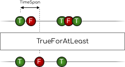

# Reactive.Boolean

Reactive Extensions meant specifically for implementations of `IObservable<bool>`

This documentation uses marble diagrams to explain the transformations of `IObservable<bool>`. More on marble diagrams can be found in the documentation of [ReactiveX](https://reactivex.io/documentation/observable.html).

Article containing examples in relation to home automation: [Article with examples](https://dev.to/devjaspernl/supercharging-home-assistant-automations-initial-states-and-boolean-logic-for-netdaemon-rx-3bd5).

## Logical Operators

This library has extension methods for logical operators.

### Stateful observables
All operators except for `Not` are implemented using `CombineLatest`. This means that the first output is only emitted if all inputs have emitted an value after subscribing. For this reason, it makes sense to apply these logical operators to stateful observables. In this context these are observables that emit their current state the moment an observer subscribes to them. This can easily be achieved by using `Prepend`, preferably in combination with `Observable.Defer`. For example:
```csharp
Observable.Defer(() => stateChanges.Prepend(initialState));
```

### Distinctness
Depending on the operator, there are several ways of handling value distinctness. Different forms are explained below.

### Not

Returns an observable in which the input is inverted.


### And

Returns an observable that combines the latest of the provided observables using an AND operator.
The `And` method accepts three values to determine distinctness of the output:

**OutputDistinctUntilChanged (default)**

DistinctUntilChanged is applied to the returned observable, meaning a "true" can only be followed by a "false" and vice versa.


**InputDistinctUntilChanged**

DistinctUntilChanged is applied to the inputs only. Meaning that consecutive values on the input do not change the output, but input changes on different inputs can. For example, going from "false", "false" to "true", "false" will emit consecutive "false" values.

.png)

**NotDistinct**

DistinctUntilChanged is never applied. Meaning both consecutive input and output values will be emitted.

.png)

### Or

Returns an observable that combines the latest of the provided observables using an OR operator.
The `Or` method accepts three values to determine distinctness of the output:

**OutputDistinctUntilChanged (default)**

DistinctUntilChanged is applied to the returned observable, meaning a "true" can only be followed by a "false" and vice versa.


**InputDistinctUntilChanged**

DistinctUntilChanged is applied to the inputs only. Meaning that consecutive values on the input do not change the output, but input changes on different inputs can. For example, going from "true", "false" to "true", "true" will emit consecutive "true" values.

.png)

**NotDistinct**

DistinctUntilChanged is never applied. Meaning both consecutive input and output values will be emitted.

.png)

### XOr

Returns an observable that combines the latest results of two observables using an XOR operator.
As changing distinct inputs will always result in a distinct XOR output, the `Xor` method accepts only two values to determine distinctness of the output:

**distinctUntilChanged = true (default)**

DistinctUntilChanged is applied to the result.


**distinctUntilChanged = false**

DistinctUntilChanged is not applied to the result.

.png)

### Inverted operators

This library also implements inverted operators `Nand`, `Nor` and `Xnor`.

## Scheduling

This library also has extension methods for scheduling:

### TrueForAtLeast

Returns an observable that won't emit `false` for at least the provided timespan after an initial `true` is emitted by the source observable.
If a `false` is emitted during the provided timespan, it will be emitted immediately after the timer is completed.



**Example Use Case**

Turn on a light for at least 3 seconds after a button was pressed. If 3 seconds are passed, only keep it on if the button is still being pressed, but immediately turn if off if not.
```csharp
// buttonPressed is a IObservable<bool>
var buttonPressed = button.StateChanges().Select(s => s.State == "pressed");
buttonPressed
    .TrueForAtLeast(TimeSpan.FromSeconds(3), scheduler)
    .SubscribeTrueFalse(
        () => light.TurnOn(),
        () => light.TurnOff());
```

### PersistTrueFor

Returns an observable that delays the first `false` that is emitted after a `true` by the source for a duration of a provided timespan.


**Example Use Case**

Keep a light on for 3 more seconds after last motion was detected.
```csharp
// motionDetected is a IObservable<bool>
var motionDetected = motionSensor.StateChanges().Select(s => s.State == "motion detected");
motionDetected
    .PersistTrueFor(TimeSpan.FromSeconds(3), scheduler)
    .SubscribeTrueFalse(
        () => light.TurnOn(),
        () => light.TurnOff());
```

### WhenTrueFor

Returns an observable that emits `true` once the source does not emit `false` for a minimum of the provided timespan.


**Example Use Case**

Send notification when washing machine power has been 0 for at least 1 minute.
```csharp
// washingMachineCurrentIsZero is a IObservable<bool>
var washingMachineCurrentIsZero = washingMachineCurrent.StateChanges().Select(s => s.State == 0);
washingMachineCurrentIsZero
    .WhenTrueFor(TimeSpan.FromMinutes(1), scheduler)
    .SubscribeTrue(() => notification.Send("Washing machine is done!"));
```

### LimitTrueDuration

Returns an observable that will automatically emit `false` if the source does not emit a `false` itself within the provided timespan after emitting `true`.


**Example Use Case**

Keep closet lights on for a maximum amount of time.
```csharp
// closetDoorOpen is a IObservable<bool>
var closetDoorOpen = closetDoor.StateChanges().Select(s => s.State == "open");
closetDoorOpen
    .LimitTrueDuration(TimeSpan.FromMinutes(2), scheduler)
    .SubscribeTrueFalse(
        () => closetLight.TurnOn(),
        () => closetLight.TurnOff());
```

## Subscribing

Besides transformations, this library has extension methods that help with common cases of subscribing to implementations of `IObservable<bool>`: `SubscribeTrueFalse`, `SubscribeFalse` and `SubscribeTrue`.

### Example

```cs
boolObservable.SubscribeTrueFalse(
    () => {
        // Logic for when observable emits true.
    },
    () => {
        // Logic for when observable emits false.
    }
)
```