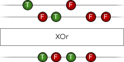

# Reactive.Boolean

Reactive Extensions meant specifically for implementations of `IObservable<bool>`

This documentation uses marble diagrams to explain the transformations of `IObservable<bool>`. More on marble diagrams can be found in the documentation of [ReactiveX](https://reactivex.io/documentation/observable.html).

## Logical Operators

This library has extension methods for logical operators:

### Not


### And


### And (not distinct)

.png)

### Or


### Or (not distinct)

.png)

### XOr



## Scheduling

This library also has extension methods for scheduling:

### PersistTrueFor

Returns an observable that stays true for a time span once the base observable turns back to false.


### WhenTrueFor

Returns an observable that emits true once the base observable emits true for a minimum time span.


### LimitTrueDuration

Returns an observable that stays true for a maximum of time span. If the base observable emits false before the time has passed, the resulting observable also emits false.


## Subscribing

Besides transformations, this library has extension methods that help with common cases of subscribing to implementations of `IObservable<bool>`: `SubscribeTrueFalse`, `SubscribeFalse` and `SubscribeTrue`.

### Example

```cs
boolObservable.SubscribeTrueFalse(
    () => {
        // Logic for when observable emits true.
    },
    () => {
        // Logic for when observable emits false.
    }
)
```